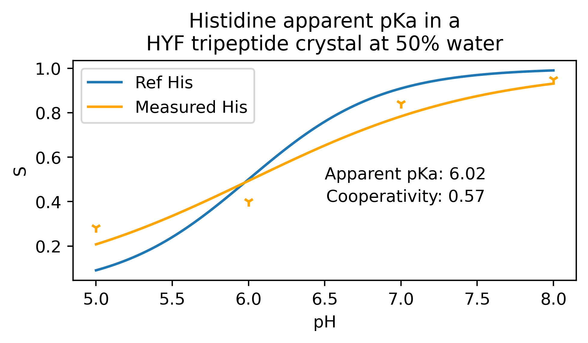

# PyNAMD

Python tools for NAMD, including constant pH MD.

## Description

PyNAMD is a package meant to provide a flexible, lightweight interface to NAnoscale Molecular Dynamics ([NAMD](http://www.ks.uiuc.edu/Research/namd/)) input and output. Since many powerful and mature packages exist for trajectory analysis, the focus is almost exclusively on energy based output.

The PyNAMD library is also accompanied by several scripts for common tasks useful in molecular dynamics (MD) simulations, such as rapidly computing averages and fluctuations - all directly from NAMD output. Developments are ongoing to provide considerably more complicated analysis tools such as multistate reweighting methods (e.g., WHAM) for generalized ensemble, replica exchange, and stratified umbrella sampling simulations.

## Installation

To install PyNAMD, with a few updates:

```
pip install git+https://github.com/beck-vant/pynamd
```


## Examples

### Normal MD

```python
import pynamd

log = pynamd.NamdLog("00001.log", "00002.log")

#info contains information about time-steps, temperatures etc...
log.info

#energy contains the time-series data in a dictionary
log.energy

#log.energy can easily be converted into a pandas dataframe
import pandas as pd 
df =  pd.DataFrame(log.energy)
```

### Constant pH (*.cphlog) outputs

Brief snippet for reading the states and convert that info in a deprotonation (S) value:

```python
import pynamd
cphlogs = [f"examples/pH5.0/*cphlog"]
configfiles = ["examples/Radak.json"]

        
pynamd_parser = pynamd.cphlog.TitratableSystemSet.from_cphlogs([cphlogs], configfiles)
pH = float(pynamd_parser.pHs[0])

states = pynamd_parser.macro_occupancies() #1 = proton occupies space
# so we reverse it to the S value which is 1 = deprotonated
states -= 1
states = np.abs(states)

S = states.mean() # deprotonation (S) value over time and all titratable molecules
```

For more extensive works see See [cphmd_usage.py](cphmd_usage.py)



## Tests

Tests can be run using the [pytest](http://doc.pytest.org/en/latest/) framework. Install pytest using conda `conda install pytest` or pip `pip install pytest`.

Run with `pytest` in the root of the repository.  


## Authors and Contributors

* Brian Radak | brian.radak@gmail.com (original and main author)
* Alexander van Teijlingen | alex@modelmole.com (small edits for constant pH MD logs)
